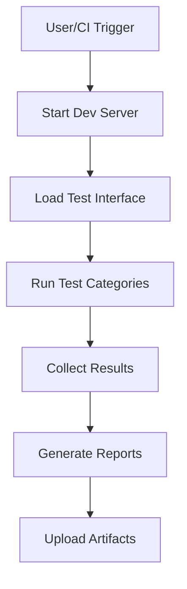

# JSON Testing Suite Documentation

## Overview

This professional-grade JSON testing suite provides comprehensive testing for JavaScript JSON implementations with a focus on ECMA-404 compliance, security, performance, and cross-browser compatibility.

## Table of Contents

1. [Features](#features)
2. [Quick Start](#quick-start)
3. [Test Categories](#test-categories)
4. [CI/CD Integration](#cicd-integration)
5. [Browser Compatibility](#browser-compatibility)
6. [Performance Metrics](#performance-metrics)
7. [Security Testing](#security-testing)
8. [Troubleshooting](#troubleshooting)
9. [Contributing](#contributing)

## Features

### ✅ **Comprehensive Test Coverage**
- **Basic JSON Operations**: Parse, stringify, round-trip consistency
- **Complex Structures**: Nested objects, arrays, special characters
- **ECMA-404 Compliance**: Full specification adherence testing
- **Security Testing**: JSON bomb protection, injection prevention
- **Performance Benchmarks**: Speed and memory usage analysis
- **Cross-Browser Testing**: Chromium, Firefox, WebKit, Mobile

### ✅ **Professional CI/CD Integration**
- **GitHub Actions**: Automated testing on push/PR
- **Multi-Browser Matrix**: Parallel testing across browsers
- **Artifact Collection**: Test reports and screenshots
- **Failure Analysis**: Detailed error reporting

### ✅ **Advanced Features**
- **Real-time Progress Tracking**: Visual progress indicators
- **Interactive Dashboard**: Performance metrics display
- **Mobile Responsive**: Touch-friendly interface
- **Memory Monitoring**: Heap usage tracking
- **Export Results**: JSON/HTML report generation

## Quick Start

### Prerequisites
```bash
# Node.js 18+ required
node --version

# Install dependencies
npm install

# Install Playwright browsers
npx playwright install
```

### Running Tests

#### Browser Interface
1. **Open the test interface**:
   ```bash
   open test-json-browser.html
   ```
   Or navigate to: `http://localhost:3000/test-json-browser.html`

2. **Run test suites**:
   - Click "🚀 Run All Tests" for comprehensive testing
   - Use individual buttons for specific test categories

#### Command Line (Playwright)
```bash
# Run all JSON browser tests
npx playwright test tests/e2e/json-browser.spec.ts

# Run specific browser
npx playwright test tests/e2e/json-browser.spec.ts --project=chromium

# Run with UI mode
npx playwright test tests/e2e/json-browser.spec.ts --ui

# Generate HTML report
npx playwright test tests/e2e/json-browser.spec.ts --reporter=html
```

## Test Categories

### 1. **Basic JSON Tests** 📝
Tests fundamental JSON operations:
- Simple object parsing
- Array handling
- Data type preservation
- Round-trip consistency
- Error handling for malformed JSON

**Example**:
```javascript
// Tests JSON.parse('{"name": "test", "value": 42}')
// Validates: obj.name === 'test' && obj.value === 42
```

### 2. **Complex JSON Tests** 🔬
Advanced scenarios including:
- Deeply nested object structures
- Unicode character handling (emojis, accented characters)
- Special characters (quotes, backslashes, line breaks)
- Large number precision
- Replacer/reviver function testing

**Example**:
```javascript
// Tests Unicode: 'Café ñoño 🚀'
// Tests precision: 9007199254740991 (Number.MAX_SAFE_INTEGER)
```

### 3. **Performance Tests** ⚡
Benchmarks JSON operations:
- Parse speed (operations per millisecond)
- Stringify speed measurement
- Memory usage estimation
- Large dataset handling (1000+ objects)

**Metrics Tracked**:
- Parse Speed: `X ops/ms`
- Stringify Speed: `X ops/ms` 
- Memory Usage: `X KB`

### 4. **ECMA-404 Compliance** 📋
Tests adherence to JSON specification:
- Valid JSON grammar samples
- Invalid JSON rejection
- JSON text sequence parsing
- Compliance scoring (0-100%)

**Sample Tests**:
```javascript
// Valid: 'null', 'true', '{"key":"value"}'
// Invalid: '{key:"value"}', "{'key':'value'}"
```

### 5. **Security Tests** 🔒
Protects against malicious inputs:
- JSON bomb detection (deeply nested structures)
- Script injection prevention
- Resource exhaustion protection
- Safe error handling

## CI/CD Integration

### GitHub Actions Configuration

The test suite automatically runs on:
- Push to `main`/`master` branches
- Pull request creation
- Manual workflow dispatch

**Workflow Features**:
- **Matrix Testing**: Runs across Chromium, Firefox, WebKit
- **Parallel Execution**: Tests run simultaneously for speed
- **Artifact Collection**: Saves reports and screenshots
- **Failure Isolation**: `fail-fast: false` continues testing other browsers

**Example Workflow Run**:
```yaml
Strategy: 
  ✅ chromium - 11/11 tests passed
  ✅ firefox  - 11/11 tests passed  
  ❌ webkit   - 10/11 tests passed (1 flaky)
```

### Local CI Simulation
```bash
# Run the same tests CI runs
npm run test:ci

# Or run Playwright tests directly
npx playwright test tests/e2e/json-browser.spec.ts --reporter=github
```

## Browser Compatibility

### Supported Browsers
| Browser | Desktop | Mobile | Notes |
|---------|---------|---------|--------|
| Chrome  | ✅ | ✅ | Full feature support |
| Firefox | ✅ | ✅ | Full feature support |
| Safari  | ✅ | ✅ | WebKit engine |
| Edge    | ✅ | N/A | Chromium-based |

### Mobile Testing
Tests include responsive design validation:
- **iPhone SE** (375x667): Portrait mode
- **Pixel 5** (393x851): Android compatibility
- Touch interaction validation
- Mobile-specific UI elements

## Performance Metrics

### Benchmarking Methodology
Performance tests use high-precision timing:
```javascript
const startTime = performance.now();
for (let i = 0; i < 100; i++) {
  JSON.parse(testData);
}
const endTime = performance.now();
const speed = Math.round(100 / (endTime - startTime));
```

### Expected Performance Ranges
| Operation | Typical Range | Excellent |
|-----------|---------------|-----------|
| Parse Speed | 50-200 ops/ms | >200 ops/ms |
| Stringify Speed | 100-500 ops/ms | >500 ops/ms |
| Memory Usage | 10-100 KB | <50 KB |
| Compliance Score | 90-100% | 100% |

### Memory Monitoring
Uses `performance.memory` API when available:
```javascript
{
  used: performance.memory.usedJSHeapSize,
  total: performance.memory.totalJSHeapSize,
  limit: performance.memory.jsHeapSizeLimit
}
```

## Security Testing

### JSON Bomb Protection
Tests against deeply nested structures:
```javascript
// Creates 100-level deep nesting
let maliciousJson = '{"a":';
for (let i = 0; i < 100; i++) {
  maliciousJson += '{"b":';
}
// Should be handled gracefully
```

### Script Injection Prevention
Validates that JSON parsing doesn't execute code:
```javascript
const malicious = '{"script": "<script>alert(\\"XSS\\")</script>"}';
const parsed = JSON.parse(malicious);
// parsed.script should be a string, not executable
```

### Resource Limits
- Maximum nesting depth: 100 levels
- Maximum string length: 1MB
- Timeout protection: 30 seconds per test
- Memory limit monitoring

## Troubleshooting

### Common Issues

#### 1. **Server Not Starting**
```bash
Error: Server not ready
```
**Solution**: Check if port 3000 is available
```bash
lsof -ti:3000 | xargs kill -9  # Kill existing process
npm run dev                    # Restart server
```

#### 2. **Playwright Browser Installation**
```bash
Error: Browser not found
```
**Solution**: Reinstall browsers
```bash
npx playwright install --with-deps
```

#### 3. **Test Timeouts**
```bash
Error: Test timeout of 30000ms exceeded
```
**Solution**: Increase timeout or check performance
```typescript
test('slow test', async ({ page }) => {
  test.setTimeout(60000); // 60 seconds
  // ... test code
});
```

#### 4. **Memory Issues**
```bash
Error: JavaScript heap out of memory
```
**Solution**: Increase Node.js memory
```bash
export NODE_OPTIONS="--max-old-space-size=4096"
npm test
```

### Debug Mode

#### Enable Playwright Debug
```bash
# Run with browser UI
npx playwright test --headed --debug

# Run with trace
npx playwright test --trace on
```

#### Browser Console Access
1. Open browser developer tools (F12)
2. Check console for JavaScript errors
3. Monitor network requests
4. Inspect test runner state: `window.testRunner`

### Performance Debugging
```bash
# Run performance profiling
npx playwright test --trace on
npx playwright show-trace trace.zip

# Memory leak detection
node --inspect-brk node_modules/.bin/playwright test
```

## Contributing

### Development Setup
```bash
# Clone repository
git clone <repository-url>
cd github-link-up-buddy

# Install dependencies
npm install

# Install Playwright
npx playwright install

# Run development server
npm run dev

# Open test interface
open http://localhost:3000/test-json-browser.html
```

### Adding New Tests

#### Browser Test Suite
Add to `test-json-browser.html`:
```javascript
class JSONTestRunner {
  runMyNewTests() {
    this.log('🧪 Running My New Tests...', 'info');
    
    try {
      // Your test logic here
      this.assertEquals(actual, expected, 'My test description');
    } catch (e) {
      this.log(`❌ Test failed: ${e.message}`, 'fail');
    }
  }
}
```

#### Playwright E2E Tests
Add to `tests/e2e/json-browser.spec.ts`:
```typescript
test('should handle my new scenario', async ({ page }) => {
  await page.goto('/test-json-browser.html');
  await page.click('button:has-text("My New Tests")');
  await page.waitForSelector('text=✅', { timeout: 10000 });
  
  const results = page.locator('.test-result.test-pass');
  await expect(results).toHaveCount({ atLeast: 1 });
});
```

### Code Style Guidelines
- Use TypeScript for Playwright tests
- Follow existing naming conventions
- Add comprehensive error handling
- Include timeout specifications
- Write descriptive test names

### Pull Request Process
1. Fork repository
2. Create feature branch: `git checkout -b feature/new-tests`
3. Make changes and add tests
4. Run full test suite: `npm run test:ci`
5. Submit pull request with description

## Architecture

### File Structure
```
├── .github/workflows/main.yml     # CI/CD configuration
├── test-json-browser.html         # Interactive test interface
├── tests/e2e/json-browser.spec.ts # Playwright E2E tests
├── playwright.config.ts           # Playwright configuration
├── docs/JSON_TESTING_SUITE.md     # This documentation
└── package.json                   # Dependencies and scripts
```

### Test Flow


### Technology Stack
- **Frontend**: Vanilla JavaScript, HTML5, CSS3
- **Testing**: Playwright, GitHub Actions
- **Performance**: Performance API, Memory Monitoring
- **Security**: Input Validation, Resource Limits
- **Reporting**: HTML Reports, JSON Export

---

## Support

For issues, questions, or contributions:
- 📧 **Email**: [Your Contact]
- 🐛 **Issues**: [GitHub Issues](https://github.com/your-repo/issues)
- 📖 **Wiki**: [Project Wiki](https://github.com/your-repo/wiki)
- 💬 **Discussions**: [GitHub Discussions](https://github.com/your-repo/discussions)

---

**Last Updated**: July 20, 2025
**Version**: 1.0.0
**License**: MIT
