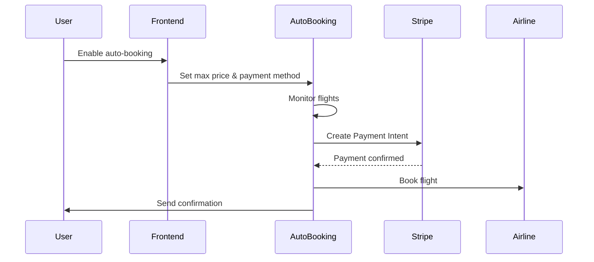

# Stripe Auto-Booking Payment Setup

## Overview

Your auto-booking system uses Stripe to securely process payments when booking flights automatically. This guide covers the production setup required.

## Required Stripe Configuration

### 1. Stripe Account Setup
- **Account Type**: Standard Stripe account (not Express or Custom)
- **Business Verification**: Complete business verification for live payments
- **Bank Account**: Connect your business bank account for payouts

### 2. Required API Keys

You need these keys from your Stripe Dashboard:

```bash
# Stripe Secret Keys (server-side)
STRIPE_SECRET_KEY=sk_live_your-live-secret-key        # For production
STRIPE_SECRET_KEY_TEST=sk_test_your-test-secret-key   # For testing

# Stripe Publishable Keys (client-side)
VITE_STRIPE_PUBLISHABLE_KEY=pk_live_your-live-publishable-key
VITE_STRIPE_PUBLISHABLE_KEY_TEST=pk_test_your-test-publishable-key

# Webhook Secret (for payment confirmations)
STRIPE_WEBHOOK_SECRET=whsec_your-webhook-secret
```

### 3. Where to Find These Keys

1. **Go to Stripe Dashboard**: https://dashboard.stripe.com/
2. **API Keys Section**: 
   - Live keys: https://dashboard.stripe.com/apikeys
   - Test keys: https://dashboard.stripe.com/test/apikeys
3. **Webhook Secret**: 
   - Go to Webhooks section
   - Create endpoint for payment confirmations
   - Copy the signing secret

## Payment Flow for Auto-Booking



## Required Stripe Products/Features

### 1. Payment Intents API
- **Purpose**: Secure payment processing with 3D Secure support
- **Setup**: Enabled by default in modern Stripe accounts
- **Configuration**: Set automatic payment methods

### 2. Saved Payment Methods
- **Purpose**: Store customer payment methods for auto-booking
- **Setup**: Enable "Save payment methods" in Dashboard
- **Security**: Uses Stripe's secure vault (PCI compliant)

### 3. Webhooks (Critical)
- **Purpose**: Confirm payments and handle failures
- **Endpoint**: `your-domain.com/api/webhooks/stripe`
- **Events to Subscribe**:
  - `payment_intent.succeeded`
  - `payment_intent.payment_failed`
  - `payment_method.attached`

### 4. Radar (Fraud Prevention)
- **Purpose**: Prevent fraudulent auto-bookings
- **Setup**: Enable basic rules in Stripe Dashboard
- **Configuration**: Set risk thresholds for auto-booking

## Environment Variables Setup

Add to your `.env.production`:

```bash
# Stripe Live Keys (Production)
STRIPE_SECRET_KEY=sk_live_51ABC...
VITE_STRIPE_PUBLISHABLE_KEY=pk_live_51ABC...
STRIPE_WEBHOOK_SECRET=whsec_ABC...

# Auto-booking specific settings
STRIPE_AUTO_BOOKING_ENABLED=true
STRIPE_CAPTURE_METHOD=automatic
STRIPE_CONFIRMATION_METHOD=automatic
```

## Testing Configuration

For development/testing, use test keys:

```bash
# Stripe Test Keys (Development)
STRIPE_SECRET_KEY=sk_test_51ABC...
VITE_STRIPE_PUBLISHABLE_KEY=pk_test_51ABC...
STRIPE_WEBHOOK_SECRET=whsec_test_ABC...

# Test mode settings
STRIPE_AUTO_BOOKING_ENABLED=false
```

## Security Requirements for Auto-Booking

### 1. Payment Method Validation
- Verify customer owns the payment method
- Require 3D Secure for first-time setups
- Validate billing address matches

### 2. Spending Limits
- Implement daily/monthly spending limits per user
- Require re-authentication for high amounts
- Send notifications for all auto-charges

### 3. Audit Trail
- Log all payment attempts and results
- Track which bookings were automatic vs manual
- Store transaction metadata for compliance

## Webhook Implementation

Your auto-booking system needs this webhook endpoint:

```typescript
// /api/webhooks/stripe
export async function POST(request: Request) {
  const signature = request.headers.get('stripe-signature');
  const body = await request.text();
  
  const event = stripe.webhooks.constructEvent(
    body,
    signature,
    process.env.STRIPE_WEBHOOK_SECRET
  );
  
  switch (event.type) {
    case 'payment_intent.succeeded':
      await handleSuccessfulPayment(event.data.object);
      break;
    case 'payment_intent.payment_failed':
      await handleFailedPayment(event.data.object);
      break;
  }
}
```

## Compliance Requirements

### 1. PCI DSS Compliance
- ✅ Using Stripe (PCI Level 1 compliant)
- ✅ AWS infrastructure configured for PCI DSS
- ✅ No card data stored locally

### 2. Strong Customer Authentication (SCA)
- Required for European customers
- Implemented via Stripe's 3D Secure
- Automatic handling in Payment Intents

### 3. Data Protection
- Payment method tokens stored securely
- Customer data encrypted at rest
- Audit logs for all transactions

## Testing Checklist

Before going live:

- [ ] Test payment flow with test cards
- [ ] Verify webhook endpoints work
- [ ] Test auto-booking with small amounts
- [ ] Verify refund process works
- [ ] Test failure scenarios (declined cards, etc.)
- [ ] Confirm PCI compliance
- [ ] Validate fraud prevention rules

## Production Deployment

1. **Switch to Live Keys**: Update environment variables
2. **Enable Webhooks**: Point to production endpoint
3. **Activate Radar**: Enable fraud prevention
4. **Monitor Transactions**: Set up alerts for failures
5. **Test with Real Money**: Small test transactions first

## Support and Monitoring

### Stripe Dashboard Monitoring
- Transaction success rates
- Failed payment reasons
- Fraud prevention alerts
- Dispute notifications

### Auto-Booking Specific Metrics
- Auto-booking success rate
- Average processing time
- User adoption rate
- Revenue from auto-bookings

## Emergency Procedures

If payment issues occur:
1. **Immediate**: Set LaunchDarkly `auto_booking_emergency_disable` to `true`
2. **Investigate**: Check Stripe Dashboard for error patterns
3. **Fix**: Address payment failures or system issues
4. **Recovery**: Re-enable auto-booking gradually

## Contact Information

- **Stripe Support**: https://support.stripe.com/
- **PCI Compliance**: https://stripe.com/guides/pci-compliance
- **API Documentation**: https://stripe.com/docs/api
