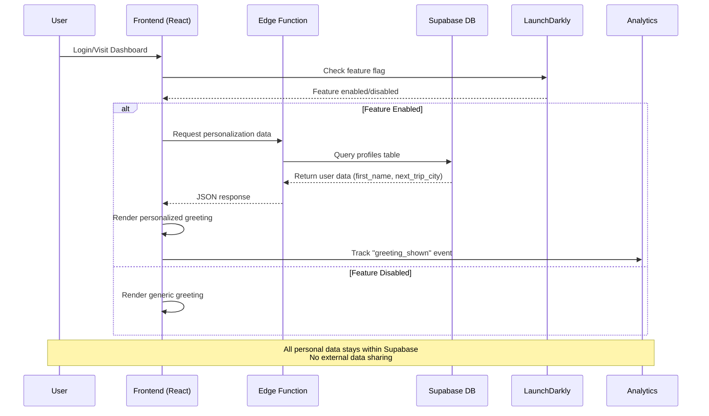

# Personalization Data Flow Architecture

## Overview
This document outlines the data flow for Parker Flight's personalization feature, designed for legal review and compliance validation.

## Data Flow Diagram

## Data Elements

### Input Data
- **User ID**: UUID from authentication
- **First Name**: Optional, from profiles table
- **Next Trip City**: Optional, from profiles table  
- **Personalization Enabled**: Boolean flag for user opt-out

### Output Data
- **Personalized Greeting**: String rendered in UI
- **Analytics Events**: Aggregated, non-PII metrics

## Privacy Safeguards

### Data Minimization
- Only first name and next trip city used
- No behavioral tracking or profiling
- No external API calls with personal data

### User Control
- Opt-out toggle in user preferences
- Feature flag for instant disable
- No data retention beyond session

### Compliance Features
- GDPR Article 6 lawful basis: Legitimate interest
- CCPA compliance with opt-out mechanism
- No data sale or sharing with third parties

## Security Measures

### Data Protection
- All data encrypted in transit (HTTPS)
- Supabase RLS policies enforce access control
- No personal data in client-side logs

### Access Control
- Edge function validates user authentication
- Database queries scoped to authenticated user
- Analytics data pseudonymized

## Rollback Capability

### Instant Disable
- LaunchDarkly feature flag can disable instantly
- No cached personal data persists
- Graceful degradation to generic experience

### Data Cleanup
- Session data cleared on logout
- No permanent client-side storage
- Database data remains for account functionality

---

**Review Required**: Legal team sign-off needed before Beta launch (Day 12)
**Last Updated**: [DATE]
**Document Owner**: Tech Lead
