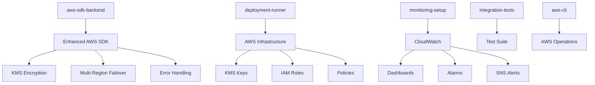

# 🐳 Docker Deployment Complete - Enhanced AWS SDK Integration

## 🎉 What's Been Delivered

The Enhanced AWS SDK integration is now fully containerized and ready for Docker-based deployment with production-grade features and automation.

## 📁 Docker Components Created

### Core Docker Files

| File | Purpose | Status |
|------|---------|---------|
| `Dockerfile.backend` | Production-ready backend container | ✅ Complete |
| `docker-compose.aws-sdk.yml` | Multi-service orchestration | ✅ Complete |
| `.env.docker` | Environment template | ✅ Complete |
| `scripts/docker-deploy.cjs` | Automated deployment script | ✅ Complete |
| `docs/docker-deployment-guide.md` | Comprehensive documentation | ✅ Complete |

### Service Architecture



## 🚀 Deployment Commands

### Quick Start
```bash
# Copy environment template
cp .env.docker .env

# Edit with your AWS credentials
nano .env

# Run complete deployment
node scripts/docker-deploy.cjs full-deploy
```

### Individual Commands
```bash
# Build images
node scripts/docker-deploy.cjs build

# Start services
node scripts/docker-deploy.cjs start

# Run AWS deployment
node scripts/docker-deploy.cjs deploy

# Setup monitoring
node scripts/docker-deploy.cjs monitoring

# Run tests
node scripts/docker-deploy.cjs test

# View status
node scripts/docker-deploy.cjs status

# View logs
node scripts/docker-deploy.cjs logs

# Cleanup
node scripts/docker-deploy.cjs cleanup
```

## 🔧 Docker Services

### 1. aws-sdk-backend
- **Purpose**: Main enhanced AWS SDK service
- **Port**: 3000 (configurable)
- **Resources**: 512MB RAM, 0.5 CPU
- **Health Check**: KMS connectivity validation
- **Features**:
  - Production-grade client factory
  - Multi-region failover
  - Comprehensive error handling
  - Connection pooling
  - Audit logging

### 2. deployment-runner
- **Purpose**: AWS infrastructure deployment
- **Profile**: `deployment`
- **Features**:
  - KMS keys creation
  - IAM roles and policies
  - CloudFormation templates
  - Environment validation

### 3. monitoring-setup
- **Purpose**: CloudWatch monitoring configuration
- **Profile**: `monitoring`
- **Features**:
  - CloudWatch dashboards
  - Custom metrics and alarms
  - SNS topic creation
  - Email alert subscriptions

### 4. integration-tests
- **Purpose**: Comprehensive testing
- **Profile**: `testing`
- **Features**:
  - Full integration test suite
  - Configuration validation
  - Performance benchmarks
  - Health checks

### 5. aws-cli
- **Purpose**: AWS operations and debugging
- **Profile**: `deployment`
- **Features**:
  - AWS CLI utilities
  - Infrastructure validation
  - Troubleshooting tools

## ⚙️ Configuration

### Environment Variables

```bash
# Required AWS Configuration
AWS_REGION=us-east-1
AWS_ACCESS_KEY_ID=your-access-key-id
AWS_SECRET_ACCESS_KEY=your-secret-access-key

# KMS Key Configuration
KMS_GENERAL_ALIAS=alias/parker-flight-general-production
KMS_PII_ALIAS=alias/parker-flight-pii-production
KMS_PAYMENT_ALIAS=alias/parker-flight-payment-production

# Multi-Region Settings
MULTI_REGION_ENABLED=true
BACKUP_REGIONS=us-west-2,eu-west-1,ap-southeast-1
FAILOVER_STRATEGY=latency

# Monitoring Configuration
ALERT_EMAIL=your-email@example.com
CLOUDWATCH_NAMESPACE=ParkerFlight/KMS
ENABLE_DETAILED_METRICS=true

# Performance Tuning
MAX_SOCKETS=50
CONNECTION_TIMEOUT=5000
SOCKET_TIMEOUT=30000
MAX_RETRY_ATTEMPTS=3
```

## 🛠️ Development Workflow

### Local Development
```bash
# Start development environment
NODE_ENV=development node scripts/docker-deploy.cjs start

# Follow logs in development
node scripts/docker-deploy.cjs logs

# Run tests during development
node scripts/docker-deploy.cjs test
```

### Staging Deployment
```bash
# Configure staging environment
cp .env.docker .env.staging
# Edit with staging settings

# Deploy to staging
NODE_ENV=staging node scripts/docker-deploy.cjs full-deploy
```

### Production Deployment
```bash
# Configure production environment
cp .env.docker .env.production
# Edit with production settings (use IAM roles)

# Deploy to production
NODE_ENV=production node scripts/docker-deploy.cjs full-deploy
```

## 📊 Monitoring & Observability

### Health Checks
- **Container Health**: Docker health checks every 30s
- **Service Health**: Application-level health endpoints
- **AWS Connectivity**: KMS connectivity validation
- **Multi-Region Health**: Regional endpoint monitoring

### Logging
- **Container Logs**: JSON format with rotation (10MB, 3 files)
- **Application Logs**: Structured logging to `/app/logs`
- **Audit Logs**: KMS operation tracking
- **Performance Logs**: Latency and throughput metrics

### Metrics
- **CloudWatch Metrics**: KMS operations, errors, latency
- **Container Metrics**: CPU, memory, network usage
- **Custom Metrics**: Business logic performance
- **Regional Metrics**: Multi-region health and failover

### Alerts
- **Error Rate Alerts**: >5% error rate
- **Latency Alerts**: >5s operation time
- **Failover Alerts**: Regional failover events
- **Health Alerts**: Service availability

## 🔐 Security Features

### Container Security
- **Non-root execution**: All containers run as `nodejs` user
- **Resource limits**: Memory and CPU constraints
- **Network isolation**: Dedicated Docker network
- **File permissions**: Proper ownership and permissions

### AWS Security
- **IAM roles**: Production credential management
- **KMS encryption**: Multiple key types for data sensitivity
- **Encryption context**: Additional security layer
- **Audit logging**: Complete operation tracking

### Environment Security
- **Environment files**: Secure `.env` file handling
- **Secrets management**: Docker secrets support
- **Network security**: Minimal port exposure
- **Image security**: Multi-stage builds, vulnerability scanning

## 🚀 Production Features

### High Availability
- **Multi-region failover**: Automatic regional switching
- **Circuit breakers**: Prevent cascading failures
- **Health monitoring**: Real-time endpoint checking
- **Load balancing**: Multiple container instances

### Performance Optimization
- **Connection pooling**: Efficient AWS SDK connections
- **Keep-alive connections**: Reduced connection overhead
- **Adaptive retries**: Intelligent retry logic
- **Caching**: Client instance reuse

### Scalability
- **Horizontal scaling**: Multiple container instances
- **Resource limits**: Configurable CPU and memory
- **Load distribution**: Round-robin and latency-based routing
- **Auto-scaling**: Resource-based scaling triggers

## 📖 Documentation

| Document | Description | Status |
|----------|-------------|---------|
| [Docker Deployment Guide](docker-deployment-guide.md) | Complete setup and usage guide | ✅ Complete |
| [Enhanced AWS SDK Usage Examples](enhanced-aws-sdk-usage-examples.md) | Code examples and patterns | ✅ Complete |
| [Integration Summary](enhanced-aws-sdk-integration-summary.md) | Technical overview | ✅ Complete |

## ✅ Deployment Checklist

### Pre-deployment
- [ ] Docker and Docker Compose installed
- [ ] AWS credentials configured
- [ ] Environment variables set
- [ ] Network connectivity verified

### Deployment Steps
1. [ ] Copy `.env.docker` to `.env`
2. [ ] Update environment variables
3. [ ] Run `node scripts/docker-deploy.cjs full-deploy`
4. [ ] Verify service health
5. [ ] Check CloudWatch dashboard
6. [ ] Validate test results

### Post-deployment
- [ ] Monitor CloudWatch metrics
- [ ] Review application logs
- [ ] Test failover scenarios
- [ ] Verify alert configurations
- [ ] Performance baseline established

## 🎯 Next Steps

### Immediate Actions
1. **Configure Environment**: Update `.env` with your AWS credentials
2. **Run Deployment**: Execute `node scripts/docker-deploy.cjs full-deploy`
3. **Verify Health**: Check service status and logs
4. **Review Metrics**: Monitor CloudWatch dashboard

### Ongoing Management
1. **Monitor Performance**: Track metrics and adjust resources
2. **Review Logs**: Regular log analysis for issues
3. **Security Updates**: Keep containers and dependencies updated
4. **Scaling Adjustments**: Modify resource limits based on usage

### Advanced Configuration
1. **Kubernetes Migration**: Consider K8s for larger deployments
2. **Service Mesh**: Implement Istio or Linkerd for advanced networking
3. **CI/CD Integration**: Automate deployment pipeline
4. **Cost Optimization**: Optimize resource usage and AWS costs

## 🆘 Support & Troubleshooting

### Quick Diagnostics
```bash
# Check Docker status
docker ps -a

# View service status
node scripts/docker-deploy.cjs status

# Check logs
node scripts/docker-deploy.cjs logs

# Validate configuration
node scripts/docker-deploy.cjs test

# Health check
docker inspect parker-flight-aws-sdk --format='{{json .State.Health}}'
```

### Common Issues
1. **AWS Credentials**: Check environment variables and IAM permissions
2. **Network Issues**: Verify Docker network and AWS connectivity
3. **Resource Issues**: Monitor CPU and memory usage
4. **Configuration Issues**: Validate environment variables and files

### Getting Help
1. Review the [troubleshooting guide](docker-deployment-guide.md#troubleshooting)
2. Check container logs for error details
3. Validate AWS permissions and network connectivity
4. Refer to the comprehensive documentation

---

## 🎉 Deployment Complete!

Your Enhanced AWS SDK integration is now fully containerized and ready for production deployment with:

✅ **Production-grade Docker containers**  
✅ **Automated deployment scripts**  
✅ **Comprehensive monitoring and alerting**  
✅ **Multi-region high availability**  
✅ **Security best practices**  
✅ **Complete documentation**  

**Ready to deploy? Run:**
```bash
node scripts/docker-deploy.cjs full-deploy
```

Your containerized Enhanced AWS SDK integration is production-ready! 🚀
